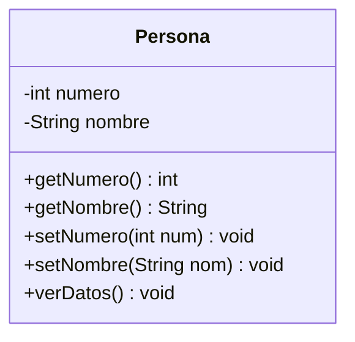

```mermaid
classDiagram
    class Persona {
      -int numero
      -String nombre
      +getNumero() int
      +getNombre() String
      +setNumero(int num) void
      +setNombre(String nom) void
      +verDatos() void
    }
```