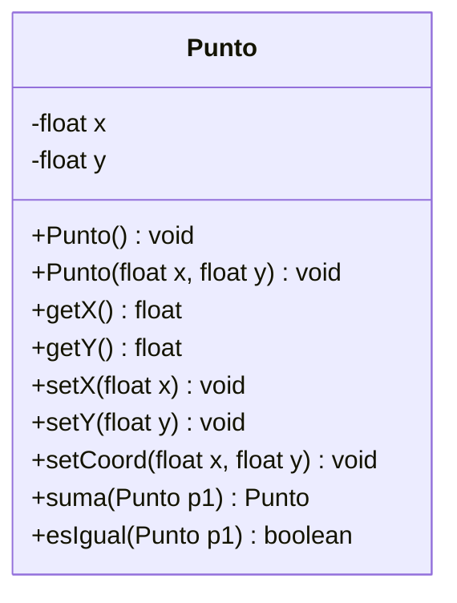

```mermaid
classDiagram
    class Punto {
      -float x
      -float y

      +Punto() void
      +Punto(float x, float y) void

      +getX() float
      +getY() float
      +setX(float x) void 
      +setY(float y) void
      +setCoord(float x, float y) void

      +suma(Punto p1) Punto
      +esIgual(Punto p1) boolean
    }
```