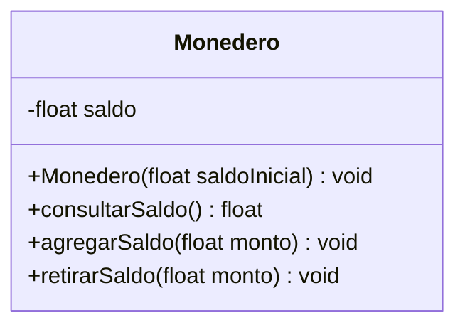

# Diagrama UML

```mermaid
classDiagram
    class Monedero {
      -float saldo

      +Monedero(float saldoInicial) void

      +consultarSaldo() float
      +agregarSaldo(float monto) void
      +retirarSaldo(float monto) void
    }
```