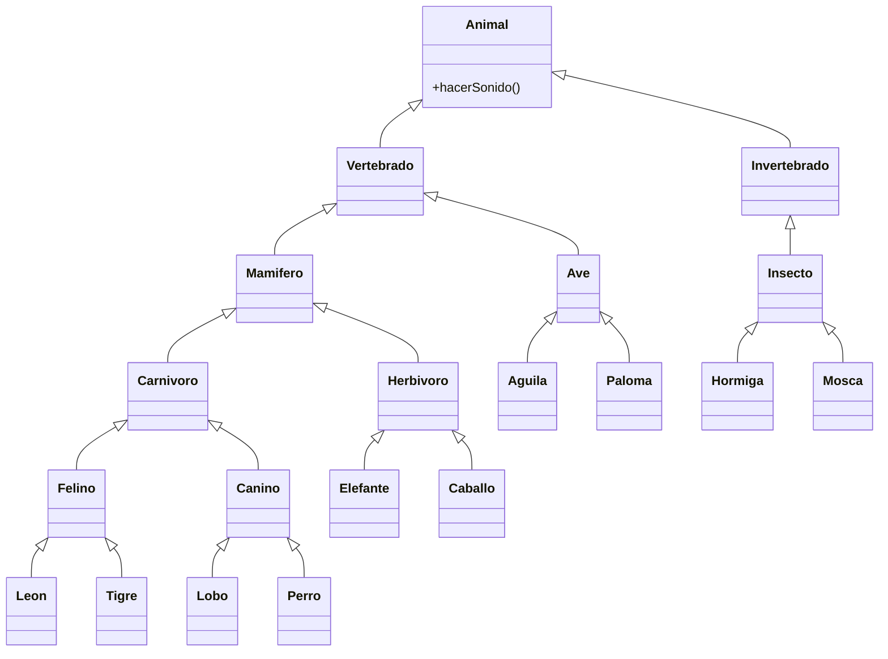

# Diagrama de Clases - Animales

```mermaid
classDiagram
    class Animal {
        +hacerSonido()
    }

    Animal <|-- Vertebrado
    Animal <|-- Invertebrado

    Vertebrado <|-- Mamifero
    Vertebrado <|-- Ave
    Invertebrado <|-- Insecto

    Mamifero <|-- Carnivoro
    Mamifero <|-- Herbivoro

    Carnivoro <|-- Felino
    Carnivoro <|-- Canino

    Felino <|-- Leon
    Felino <|-- Tigre

    Canino <|-- Lobo
    Canino <|-- Perro

    Herbivoro <|-- Elefante
    Herbivoro <|-- Caballo

    Ave <|-- Aguila
    Ave <|-- Paloma

    Insecto <|-- Hormiga
    Insecto <|-- Mosca
```
