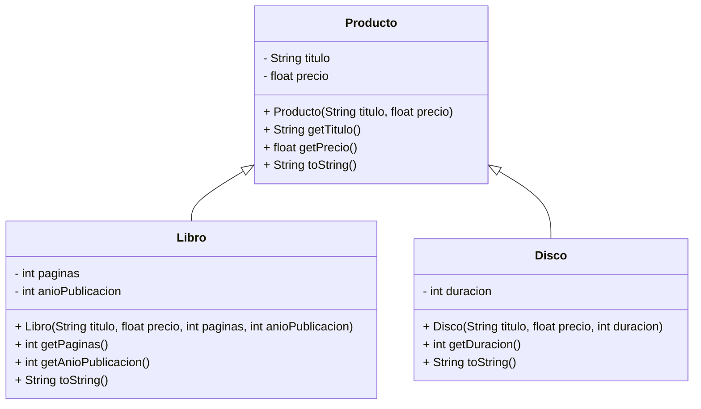

# Diagrama de clases - UML

```mermaid
classDiagram
    class Producto {
        - String titulo
        - float precio
        + Producto(String titulo, float precio)
        + String getTitulo()
        + float getPrecio()
        + String toString()
    }

    class Libro {
        - int paginas
        - int anioPublicacion
        + Libro(String titulo, float precio, int paginas, int anioPublicacion)
        + int getPaginas()
        + int getAnioPublicacion()
        + String toString()
    }

    class Disco {
        - int duracion
        + Disco(String titulo, float precio, int duracion)
        + int getDuracion()
        + String toString()
    }

    Producto <|-- Libro
    Producto <|-- Disco
```